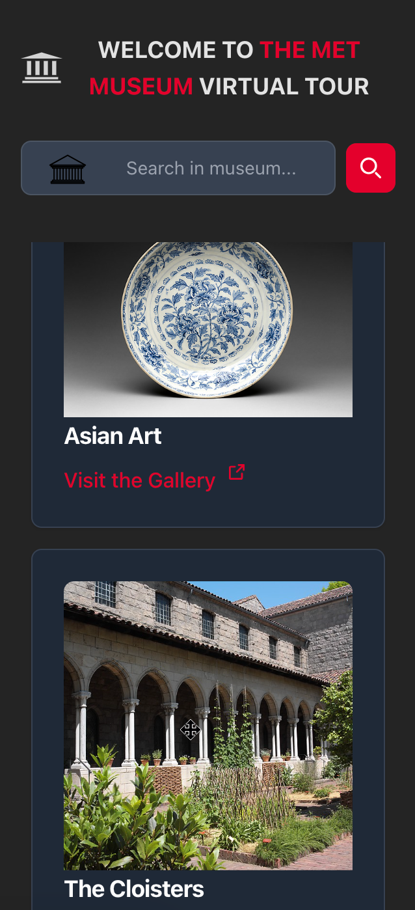
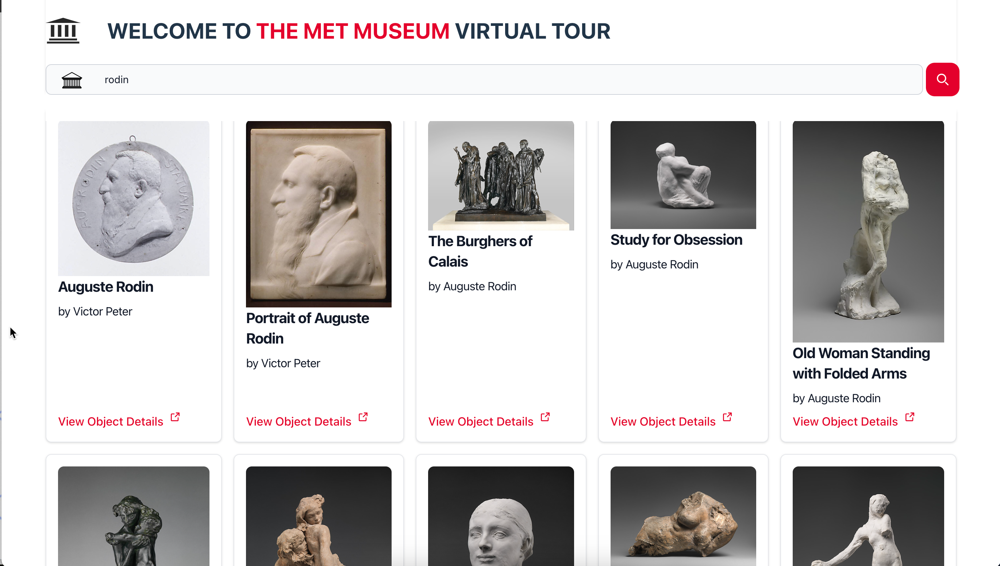

# Virtual Visit of the Met Museum

This is a sample [React](https://react.dev/) app against [The Metropolitan Museum of Art Collection API](https://metmuseum.github.io/) enabling navigation, browsing and searching the different gallery and object.

Mobile version in dark mode                                                              |  Desktop version - search
:---------------------------------------------------------------------------------------:|:---------------------------------------------------------------------------------------:
   | 

### Features
When the application first renders, it will list all available gallery and will render for each gallery a random image from this gallery (we run search for objects including pictures but the API might return an object without picture so no pic is displayed in this case).

You can decide to browse a specific gallery and see all available objects from the gallery.

You can search accross all the museum or if you're in a specific gallery, the search will limit to the current gallery.

The object details page will display some information and links about the object as well as the different images if any are available.

### Technical Corner
Technically, this contains many features a React app would require:
- React router and multiple routes
- Fetching data from [The Metropolitan Museum of Art Collection API](https://metmuseum.github.io/)
- Custom pagination (there' no pagination in the met's API)
- Cache using Session Storage
- Github Action for automatic deployment as Github pages
- The hosted version uses the react router's `HashRouter` but would be preferable `BrowserRouter`
- Made with the help of [Tailwind css](https://tailwindcss.com/) in order to get acceptable design
